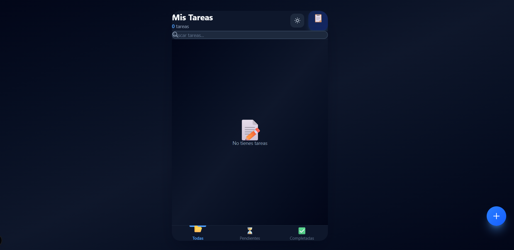
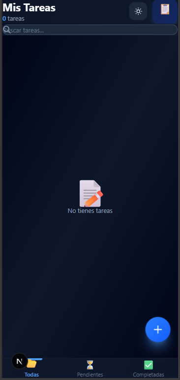

Todo App – Frontend Portfolio Project

A modern Todo application built with React, Next.js, and TypeScript, focused on clean component architecture, smooth user experience, and mobile-first design.

This project is part of my frontend portfolio and showcases state management, reusable components, UI/UX decisions, and best practices in modern React development.

✨ Live Demo

Deployment in progress

🚀 Features

- Create, edit, and delete tasks

- Mark tasks as completed or pending

Filter tasks by status:

- All

- Pending

- Completed

Task priorities:

- Low

- Medium

- High

Due date support with visual indicators:

- Today

- Overdue

- Upcoming

- Real-time task search

- Smooth animations and transitions

- Fully responsive, mobile-first UI

Note: The application UI is in Spanish, while the code and documentation are in English.

🧠 Project Structure

The project follows a clean and scalable structure using the Next.js App Router:

src/
├── app/
│ ├── globals.css # Global styles and animations
│ ├── layout.tsx # Root layout
│ └── page.tsx # Main application page
│
├── components/
│ ├── TodoApp.tsx # Main application logic and state
│ ├── Header.tsx # Header with counters and theme toggle
│ ├── SearchBar.tsx # Real-time task search
│ ├── TodoInput.tsx # Task creation form
│ ├── TodoList.tsx # Task list rendering
│ ├── TodoItem.tsx # Individual task component
│ ├── BottomNav.tsx # Mobile-style bottom navigation
│ ├── TodoFilters.tsx # Task filters (currently unused)
│ └── TodoStats.tsx # Task statistics (currently unused)
│
└── package.json # Dependencies and scripts

Note: Some components are intentionally not used at the moment, as they were part of earlier iterations and are kept for future improvements.

⚙️ Tech Stack

React

- Next.js (App Router)

- TypeScript

- Tailwind CSS

- LocalStorage

- CSS Animations

🧩 Key Implementation Details

- State management using useState and useEffect

- Combined filtering logic (status + search query)

- Theme persistence via localStorage

- Conditional animations for editing and deleting tasks

- Clean, readable, and scalable component-based architecture

🛠 Installation & Usage

npm install
npm run dev

🎯 Project Purpose

This project was built to:

Demonstrate strong fundamentals in React + TypeScript

Showcase component organization and reusability

Create a real-world, polished UI similar to production apps

Serve as a core project in my frontend developer portfolio

👤 Author

Andy Sebastian

Frontend Developer

GitHub: https://github.com/andx13

Portfolio: In progress

⭐ Future Improvements

- Drag & drop task reordering

- Task categories or tags

- Finalize dark / light theme toggle
